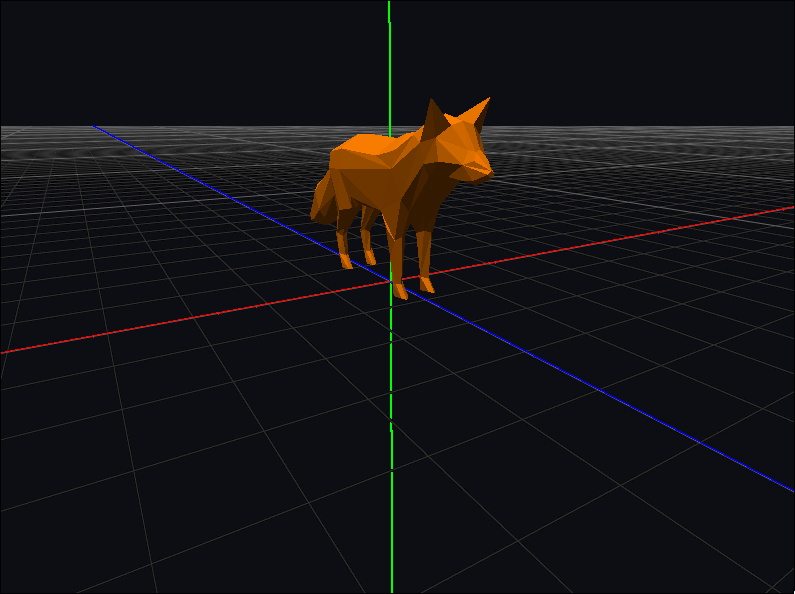

    

Minimal C/C++ and OpenGL 3D graphics engine intended for educational projects. It serves as a submodule of the game engine and can be also used independently as a standalone tool. Graphical user interface is not present and not planned yet, so it can be regarded as a graphics library.

    

