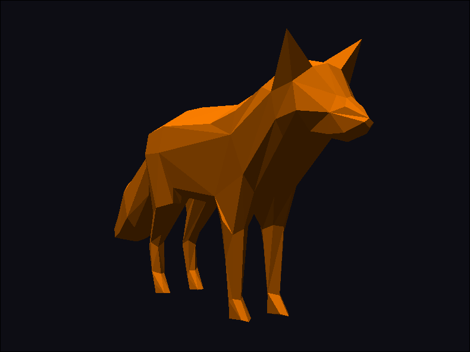

    

Minimal C/C++ and OpenGL 3D graphics engine intended for a bachelor’s thesis project. It is serving as a submodule of the [luchengine](https://github.com/admtrv/luchengine)
game engine but usable independently as a standalone tool and currently tested in `main.cpp`. Graphical user interface is not present and not planned yet, so it can be regarded as a graphics library.

    

